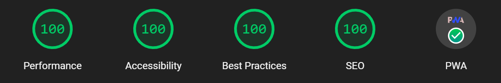

# Manga Reader 📚

A self-hosted website for reading local manga.

## Table of Contents

- [Manga Reader 📚](#manga-reader-)
  - [Table of Contents](#table-of-contents)
  - [Status 🚦](#status-)
  - [Features ✨](#features-)
  - [Upcoming Features 📅](#upcoming-features-)
  - [Usage 🚀](#usage-)
  - [Self-Hosting 🖥️](#self-hosting-️)
  - [Contributing 🤝](#contributing-)
  - [Contributors ✨](#contributors-)
  - [Tech Stack 🛠️](#tech-stack-️)
  - [Lighthouse 🦅](#lighthouse-)
  - [License 📝](#license-)

## Status 🚦

🚧 WORK IN PROGRESS 🚧

## Features ✨

- Read manga from /public folder 📖
- Minimalistic UI 🎨
- Resume reading with the last read page (local storage) 📌
- Image preloading & optimization for faster navigation 🚀
- Keyboard navigation (left/right arrow keys) ⌨️
- Mobile App PWA 📱
- Dark mode for OLED screens 🌑
- Full screen mode using all available space for the images 🖼️
- Search Bar 🔎
- English, French and custom language support 🌐

## Upcoming Features 📅

- .env file for preselected settings ⚙️
- Watching anime videos 📺
- Docker for self-hosting 🐳

## Usage 🚀

1. Rename your manga folder to the name of the manga. Inside this folder, create subfolders for each volume, named like "Tome 01", "Tome 02", etc.
2. Inside each volume folder, add the images of the pages. These should be named like "1-001.webp", "1-002.webp", etc (the first number is the chapter and the second is the page number).
3. Place the manga folder in the public folder of the project.
4. Run `npm run build` and `npm run start` to start the server.
5. Access your manga at localhost:3000.

> Note: You can use AI like ChatGPT to create a python script to rename the images for you and convert them to webp format if needed.

## Self-Hosting 🖥️

Support for Docker is currently under development. In the meantime, you can host the website on your own server by following the usage instructions provided above.

## Contributing 🤝

We love contributions from everyone. Here are a few guidelines to help you get started:

1. **Fork the Repository**: Start by forking this repository to your own GitHub account. This allows you to propose changes and create Pull Requests.

2. **Clone the Repository**: After forking, clone the repository to your local machine to start making changes. Use `git clone https://github.com/<your-username>/<repo-name>.git` to clone the repository.

3. **Create a New Branch**: Always create a new branch for your changes. This keeps the project history clean and makes it easier to manage your changes. Use `git checkout -b <branch-name>` to create and switch to a new branch.

4. **Make Your Changes**: Make your changes in the new branch. Try to keep your changes small and focused on fixing a specific issue or adding a specific feature.

5. **Commit Your Changes**: After making your changes, commit them to your branch. Write a clear and concise commit message describing what changes you made.

6. **Push Your Changes**: After committing your changes, push them to your fork on GitHub. Use `git push origin <branch-name>` to push your changes.

7. **Create a Pull Request**: Once your changes are pushed, navigate to your fork on GitHub and click the "New Pull Request" button. Fill out the Pull Request template and then submit the Pull Request.

## Contributors ✨

## Tech Stack 🛠️

This project uses the following technologies:

- 
- 
- 
- 
- 

## Lighthouse 🦅

Performance is the main focus of this project to ensure a smooth reading experience. The website is optimized for mobile and desktop devices, with a focus on image optimization and preloading.

## License 📝

This project is licensed under the terms of the [MIT license](LICENSE).
